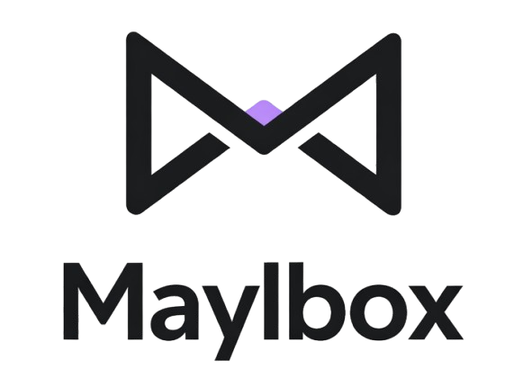

<p align="center">
  
</p>

<p align="center">
  A modern, self-hostable email client for custom domain users.
</p>

<p align="center">
  <a href="https://github.com/echovick/maylbox/actions"></a>
  <a href="LICENSE"></a>
  <a href="https://www.php.net/"></a>
</p>

---

## About

Maylbox is a modern, self-hostable email client built for users with custom domain email addresses. It connects to your existing mail server via IMAP/SMTP, giving you a clean and responsive interface to manage your email without relying on third-party providers.

## Features

- **Multi-account IMAP** — Connect and manage multiple email accounts
- **Smart auto-configuration** — Automatic IMAP/SMTP server detection
- **Threaded conversations** — View emails grouped by conversation thread
- **Folder management** — Full support for mailbox folders
- **Labels** — Organize emails with custom color-coded labels
- **Attachments** — Send and receive file attachments
- **Background sync** — Automatic email syncing via queue workers
- **Two-factor authentication** — Secure your account with 2FA
- **Dark mode** — Full dark mode support

## Tech Stack

- [Laravel 12](https://laravel.com/) — Backend framework
- [Vue 3](https://vuejs.org/) — Frontend framework
- [TypeScript](https://www.typescriptlang.org/) — Type-safe JavaScript
- [Inertia.js](https://inertiajs.com/) — SPA bridge between Laravel and Vue
- [Tailwind CSS 4](https://tailwindcss.com/) — Utility-first CSS
- [Pest](https://pestphp.com/) — Testing framework
- [Vite](https://vitejs.dev/) — Frontend build tool

## Requirements

- PHP 8.2+
- Composer
- Node.js 22+
- npm
- SQLite, MySQL, or PostgreSQL

## Quick Start

```bash
git clone https://github.com/echovick/maylbox.git
cd maylbox
composer setup
composer dev
```

`composer setup` installs dependencies, copies `.env`, generates an app key, runs migrations, installs npm packages, and builds frontend assets.

`composer dev` starts the development server, queue worker, log viewer, and Vite dev server concurrently.

## Manual Installation

```bash
# Clone the repository
git clone https://github.com/echovick/maylbox.git
cd maylbox

# Install PHP dependencies
composer install

# Copy environment file and generate app key
cp .env.example .env
php artisan key:generate

# Run database migrations
php artisan migrate

# Install Node.js dependencies and build assets
npm install
npm run build
```

## Development

Start all development services concurrently with:

```bash
composer dev
```

This runs the Laravel dev server, queue worker, log viewer (Pail), and Vite dev server side by side.

## Testing

Run the full test suite (linting + tests):

```bash
composer test
```

Run tests individually:

```bash
# PHP tests
./vendor/bin/pest

# PHP linting
composer lint

# JavaScript/Vue linting
npm run lint
```

## Contributing

Contributions are welcome! Please see [CONTRIBUTING.md](CONTRIBUTING.md) for details.

## Security

If you discover a security vulnerability, please review our [Security Policy](SECURITY.md). **Do not report security vulnerabilities through public GitHub issues.**

## License

Maylbox is open-sourced software licensed under the [MIT license](LICENSE).
